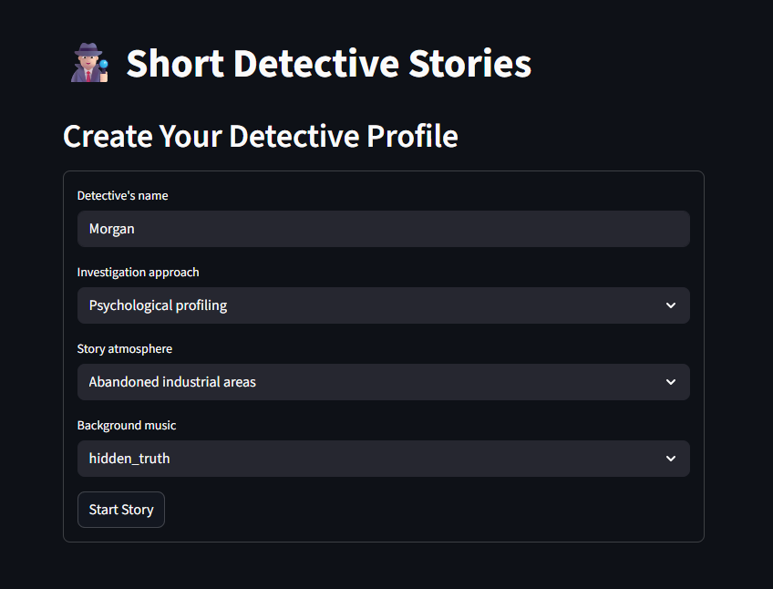
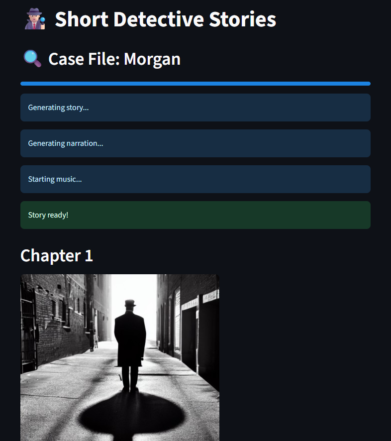

# 🕵🏻 AI-Powered Detective Story Generator

A Python and Streamlit application that generates four-chapter noir detective stories using GPT-2, with matching audio narration and background music.

## Features

- AI-generated short detective stories.
- Four-chapter structure: Discovery, First Leads, Breakthrough, Resolution
- Predefined static images per chapter
- Audio narration via Google TTS
- Two background music tracks
- Modular code structure for easy extension

## Installation

1. Clone the repository  
   https://github.com/AP-047/gen_story.git

3. Install dependencies
     pip install -r requirements.txt

5. Run the code
     streamlit run app.py

## Usage
1. Enter your detective’s name, investigation style, atmosphere, and music choice.
     
3. Click “Create My Story Experience.”
5. Read each chapter, view its image, and listen to the narration and music.
     

## Work in Progress
This project is under development. Future improvements include:
- More voice styles and faster TTS
- Additional visual themes
- Branching story paths and user choices
- Improved UI and performance optimizations
